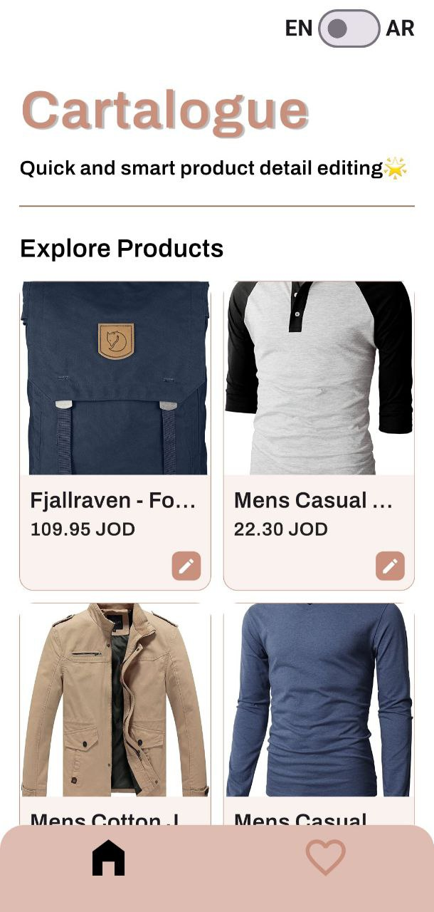
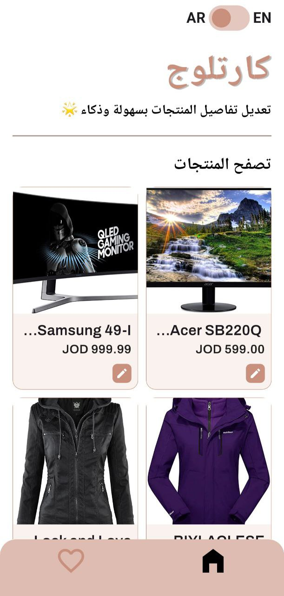
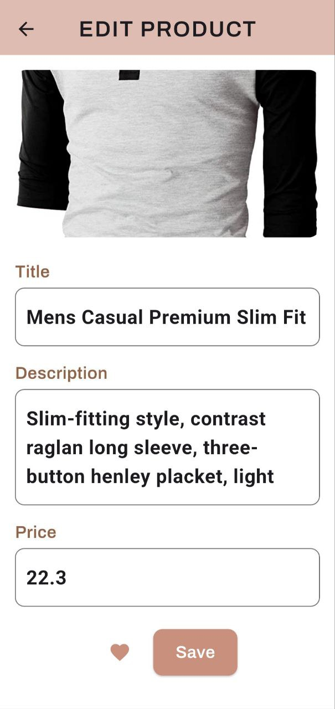
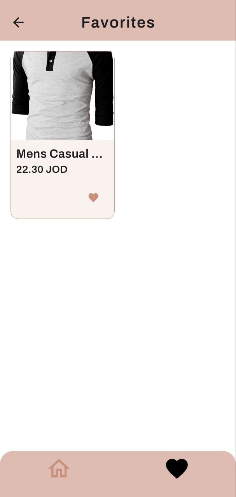

# Cartalogue

Cartalogue is a Flutter-based product catalog app that allows users to view, edit, and mark products as favorites. The app supports both Arabic and English through full localization and provides a simple and elegant UI using Riverpod for state management.

---

## Project Description

Cartalogue is a mobile app built with Flutter that helps users manage a product list easily. Users can:

- View a grid of products.
- Edit product details (title, description, price).
- Mark/unmark products as favorites.
- Switch the app language between Arabic and English.
- View favorite products separately.
- Get a responsive and localized user interface.

---

## ✨ Features

-  Localization (Arabic & English).
-  Riverpod state management.
-  Product grid with network image fallback.
-  Favorites list using in-memory state.
-  Live product editing screen.
-  Smooth navigation using auto_route.
-  Custom design and clean UI layout.

---

## Packages Used

| Package                | Description                                |
|------------------------|--------------------------------------------|
| flutter_riverpod     | State management for providers             |
| auto_route           | Routing/navigation                         |
| flutter_localizations| Localization support from Flutter SDK      |
| intl                 | Internationalization for .arb files      |
| flutter_svg          | Rendering SVG placeholder images           |
| http                 | Optional: used for future API requests     |

---

##  How to Run the Project

### 1. Clone the repository

`bash
git clone https://github.com/mariamnnassar/cartalogue.git
cd cartalogue

2. Install dependencies

flutter pub get

3. Generate localization files (optional)

flutter gen-l10n

> Note: You can skip this step if the generated files are already present.

4. Run the app

flutter run

---

Supported Languages

English (en)
Arabic (ar)

The app provides a toggle switch in the home screen to switch between languages.

---

Developed By
Mariam Nassar

---
 
Screenshots

###  Home Page

### Home page translated to Arabic using localization

###  Edit Page

###  Favorites Page

---

